<picture>
  <source media="(prefers-color-scheme: dark)" srcset="assets/banner-dark.svg">
  <source media="(prefers-color-scheme: light)" srcset="assets/banner-light.svg">
  
</picture>

Hi, I'm **Ricardo Jorge** — call me RJ. I'm an **AI Product Engineer** in Lisbon, Portugal.

I've written TypeScript professionally for a decade — React since 2016, Next.js since 2018. On most projects I was the first frontend hire: I owned the architecture, tooling, component library, and pipelines from day one, then grew the team around them. Most of that work was dashboards and proprietary data explorers for **cybersecurity, crypto, and gaming** companies, which is where I fell for data-driven products and visualisation.

I've built with AI since the first releases of Copilot and ChatGPT — prompt and context engineering first, then open-source agent skills, and now full **agent harnesses** (the scaffolding that lets an AI agent plan, act, and check its own work). Today an automated fleet of AI agents maintains my personal projects.

## Building now

| Project | What it is |
|---|---|
| **[11ai](https://ai.rj11.io)** | Open-source AI skills, plugins, and workflows |
| **[11bench](https://bench.rj11.io)** | Open-source AI benchmarks |
| **[11io](https://rj11.io)** | My personal brand for B2B freelance work |

As a hands-on freelancer I build AI products for early-stage startups, from the ground up: AI data extraction from PDFs, AI SEO analytics, a GenAI portal for dermatopathology (diagnosing skin disease from tissue images), AI chats and custom GPT experiences, cybersecurity dashboards, proprietary data explorers, and scraping agents with n8n workflows.

## Ten years, shipped

```text
2025–now   rj11io — AI product engineering for early-stage startups
2024–2025  Hunt.io — data viz for threat intelligence:
           AttackCapture™, HuntSQL™, and friendlier OpenAPI docs
2023–2024  OMEGA Systems — CORE5 iGaming (online betting) platform;
           promoted to frontend team lead
2022–2023  Phantasma Chain — Phantasma Explorer, UI Storybook, TS SDK
2020–2021  BinaryEdge → Coalition — first frontend hire, then lead;
           Attack Surface Monitoring, Coalition Explorer, design system
2015–2019  the early chapters — agency co-founder, an end-to-end
           encrypted chat app, dashboards for the American Heart Assoc.
```

<details>
<summary><strong>The longer version</strong></summary>
<br>

- **Hunt Intelligence** (hunt.io) · Product / Datavis Engineer, 2024–2025 — went deep on my specialty: data visualisation for a threat-intelligence product (mapping attacker infrastructure). Built the TypeScript codebase on the latest Next.js and shadcn/ui, Playwright end-to-end tests, CI/CD on GitHub Actions, release changelogs wired to Slack. Custom viz components like the IP History Widget, core modules AttackCapture™ and HuntSQL™, and an API-docs platform built on OpenAPI that's friendlier than Swagger.
- **OMEGA Systems** (omegasys.eu) · Senior Frontend Engineer → Team Lead, 2023–2024 — built the next generation of OMEGA's iGaming platform-management system, CORE5, in TypeScript and React. Data viz for the main dashboards, the localisation module, and — as lead — the new-developer onboarding experience, team standards for tickets, docs, and async work, plus weekly talks to keep everyone sharp.
- **Phantasma Chain** (phantasma.info) · Senior Frontend Engineer, 2022–2023 — built the frontend monorepo, Phantasma Explorer, and the Phantasma UI Storybook; contributed improvements to the Phantasma TypeScript SDK. Playwright for tests, GitHub Actions for CI, Vercel for CD.
- **BinaryEdge → Coalition, Inc.** (coalitioninc.com) · Frontend Lead, 2020–2021 — started as the solo frontend engineer and grew the team behind customer-facing security apps. Introduced React, TypeScript, Next.js, and micro frontends. Built Attack Surface Monitoring on the BinaryEdge Portal (later folded into Coalition Explorer and Coalition Control); Tech Lead for Coalition Explorer, the component library, and data visualisations; migrated CI/CD from Drone to GitHub Actions.
- **Earlier** — co-founded Glaiveware, a two-person shop building bespoke web apps (2018–2019); built a React Native chat app with end-to-end encryption on the Signal protocol at Sycret.ink (2017); a full-stack dashboard for the American Heart Association (2016); analytics dashboards at NextBitt (2015–2016). Trained in IT Systems Management and Programming at Escola Profissional de Tecnologia Digital, Lisbon (2013–2016).

</details>

> 📦 My open source from 2020–2023 lives on my legacy account, [@ricardojrmcom](https://github.com/ricardojrmcom). This account is the modern one, focused on AI projects.

## Toolbox

| | |
|---|---|
| **Core** | TypeScript · React · Next.js · AI SDK · Convex · Playwright · Vercel |
| **AI engineering** | Agent harnesses · custom agent skills · automations · Claude Code · Codex · n8n |
| **UI & data** | Tailwind CSS · shadcn/ui · design systems · Storybook · d3 · Recharts · Nivo |
| **Delivery** | Team & project management · end-to-end product engineering · product design |

## Before it was a job

- Started coding by modding and reverse-engineering games and consoles; built my own fighting game on MUGEN (a classic 2D fighting-game engine).
- Ran dedicated servers for Counter-Strike, Minecraft, and half the titles I grew up on.
- At 14, LEGO Mindstorms robots took my team to second place nationally and the final four of the 2008 robotics world cup in China.
- Led gaming teams and guilds to the top of online ladders — management training in disguise.

## Say hi

I operate like a self-guided missile: point me at a target and I'll figure out how to hit it. If you have a target worth hitting —

📫 [ricardojorgexyz@gmail.com](mailto:ricardojorgexyz@gmail.com) · 🌐 [rj11.io](https://rj11.io) · 📄 [cv.rj11.io](https://cv.rj11.io) · 💼 [LinkedIn](https://linkedin.com/in/rj11io)
